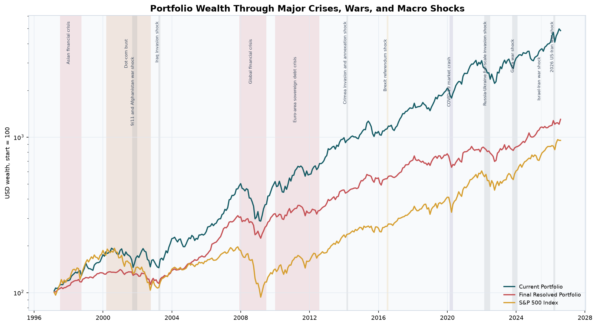

# Systematic-Cross-market-Optimisation-Portfolio-Engine

Portfolio-aware, regime-aware and sentiment-aware conservative listed-equity selection MVP for DACH, EU ex-DACH, UK, US, Mainland China and Hong Kong.

The active stock-selection universe is listed equities only. India has been removed from the active universe; options and ETFs are not included unless explicitly configured later.

The pipeline now compares three recommendation branches:

- Portfolio-Aware Quant Model
- Clean-Sheet Quant Model
- OpenAI / Claude Analyst Benchmark Model in mock mode

The LLM benchmark is an explanation and comparison layer only. It cannot bypass hard quant risk controls.

## Current Validated Run

The latest full-universe evidence package, supervised challengers and DRL
validation were regenerated on 2026-08-19. Every research challenger remains
deployment-blocked and does not change the validated baseline.

| Measure | Result |
|---|---:|
| Security master | 112,570 active and delisted listings |
| Active universe | 55,504 equities |
| Walk-forward eligible securities | 1,409 |
| Historical forecasts | 263,048 |
| Aligned realised outcomes | 262,627 |
| Portfolio decisions | 89 monthly anchors |
| Governance score | 75.0 / 100 |
| Approval | `CONDITIONALLY_APPROVED` |
| Hard constraint breaches | 0 |
| Annual turnover | 1.01x |
| Annualised cost drag | 0.83% |
| Chronological 95% / 99% VaR gates | `PASS` / `PASS` |

The complete, checksummed result is in
[`reports/releases/2026-08-19-free-data-drl-risk`](reports/releases/2026-08-19-free-data-drl-risk/README.md).

The investment-principal package presents the results in plain language:
[PowerPoint briefing](reports/presentations/wolf_investment_principal/wolf_quant_model_ic_briefing.pptx),
[rendered PDF](reports/presentations/wolf_investment_principal/wolf_quant_model_ic_briefing_2026-08-20.pdf),
[written decision report](reports/presentations/wolf_investment_principal/investment_principal_report.md),
and [publication-safe recommendation snapshot](reports/presentations/wolf_investment_principal/recommendation_snapshot.csv).
The 25-slide briefing includes a system-design diagram, an all-family supervised
model comparison, OOS diagnostics, calibrated uncertainty, DRL challengers,
portfolio differences and stock recommendations. It recommends continued paper
and shadow operation; no live, unattended or full-scale deployment is approved.


Conditional approval is deliberate. The evidence store now archives 59,183
delisting events plus aggregate local Bloomberg coverage of 25,240
database-as-of fundamental vintages, 151,659 corporate-action vintages and
694,246 historical market-cap observations. Observed filing acceptance, dated
membership, inactive-security prices, sentiment, narrative and regime vintages
remain incomplete; measured historical-volume coverage is 15.4%, below the 80%
governance threshold despite the China/HK enrichment. Licensed Bloomberg rows stay
in the ignored local warehouse and are not redistributed. This repository is
research software and does not authorize unattended live trading.

## 1997-Present Portfolio Backtest

The repository now includes a checksummed backtest package for every current
portfolio output, using USD 186,060,522 AUM for current-derived portfolios
and USD 100,000 for independent optimiser, clean-sheet, LLM, and index strategies.
It compares the portfolios with broad and region-matched indices, models USD FX,
cash, transaction costs, market impact, a hard 5% ADV execution cap, and a 25 bp
bank charge assessed annually on then-current AUM. DAX, FTSE 100 and 250, Dow
Jones, Nasdaq, Russell 2000, CAC 40, EURO STOXX 50, Nikkei 225, Swiss Market,
Shanghai, Hang Seng, S&P 500, and global ETF proxies supply benchmark context.
Lagged interest-rate and market regimes, retrospective NBER recession labels,
13 source-backed macro-event windows, moving-block resampling, fat-tailed Monte
Carlo, a 36-month embargo, PSR, MinTRL, Sidak control, and Deflated Sharpe Ratios
complete the analysis. Newey-West benchmark-alpha tests, a circular-block max-t
reality check, exact duplicate-trial removal, and CSCV Probability of Backtest
Overfitting now distinguish measured replay alpha from credible deployable alpha.

> The long history is a retrospective replay of today's holdings. It is useful for
> exposure, path, liquidity, and benchmark diagnostics, but it contains selection
> look-ahead and survivorship bias. The dated 89-decision model walk-forward remains a
> separate evidence set. The current evidence does not establish deployable alpha.

Open the complete [1997-present backtest report](reports/backtests/1997_to_latest/README.md)
or review the [42-page PDF analysis](reports/backtests/1997_to_latest/portfolio_backtest_analysis_latest.pdf),
[plain-language interpretation](reports/backtests/1997_to_latest/written_interpretation.md),
and [methodology and paper mapping](docs/BACKTEST_METHODOLOGY.md).



Run it locally with cached provider data:

```powershell
.\.venv\Scripts\python.exe scripts\run_portfolio_backtest_1997.py
```

## Quick Start

```powershell
python -m venv .venv
.\.venv\Scripts\Activate.ps1
python -m pip install -e .
Copy-Item .env.example .env
$env:USE_MOCK_DATA='true'
python scripts\run_full_pipeline.py
python -m pytest -q
```

Keep provider credentials in `.env` only. The tracked `.env.example` contains
names and safe defaults, never usable credentials.

### Bloomberg Desktop API

Bloomberg ingestion is currently paused. Keep
`BLOOMBERG_DESKTOP_ENABLED=false`; the overnight supervisor also excludes the
`bloomberg` resource group. Existing licensed observations remain only in the
ignored local DuckDB and are not removed or redistributed.

On an entitled Windows workstation with Bloomberg Terminal open and logged in:

```powershell
.\.venv\Scripts\python.exe -m pip install -r requirements-bloomberg.txt
.\.venv\Scripts\python.exe scripts\run_bloomberg_backfill.py --health-check
.\.venv\Scripts\python.exe scripts\run_bloomberg_backfill.py `
  --regions 'Mainland China' 'Hong Kong' --start 1997-01-01 --resume
.\.venv\Scripts\python.exe scripts\run_bloomberg_pit_backfill.py --coverage-only
```

Bloomberg observations remain in the ignored local DuckDB. See
[`docs/BLOOMBERG_DATA.md`](docs/BLOOMBERG_DATA.md) for limits and operations and
[`docs/PRODUCTION_POINT_IN_TIME.md`](docs/PRODUCTION_POINT_IN_TIME.md) for vintage
semantics, resume commands and measured gaps.

Run the mock-data pipeline:

```bash
python scripts/run_full_pipeline.py
```

Pull free observed reference data and annual statements into DuckDB:

~~~powershell
python scripts/run_free_equity_enrichment.py all --candidates-per-region 250
python scripts/run_free_equity_enrichment.py status
~~~

The reference phase scans every active equity in provider batches and stores market
capitalisation plus three-month average traded value. The fundamentals phase then
deduplicates issuers and fetches four reported annual periods for the strongest
liquid, dividend-paying candidates in every region. Both phases commit incrementally
and skip completed rows on restart. Use --workers 1 --request-interval-seconds 0.75
for a paced retry after a provider rate limit.

Run the checkpointed public-data stack for macro vintages, SEC filing vintages,
current FIGI mappings, OpenBB benchmark validation and China/Hong Kong OHLCV:

```powershell
python -m pip install -e ".[free-data,openbb]"
$env:SEC_USER_AGENT='The Wolf Quant Model research-contact@example.com'
python scripts/run_free_data_stack.py --start 1994-01-01
```

Each phase can be resumed independently with `--phases`. FRED/ALFRED observations
retain their release vintages; SEC Company Facts retain filing accessions and
amendments; OpenFIGI is explicitly labelled as a current snapshot rather than
historical identifier evidence. OpenBB normalises a named upstream provider and is
used for cross-validation, not counted as an independent data source. AKShare uses
unadjusted bars so a secondary source can fill volume without replacing the
preferred provider's adjusted close. The orchestrator runs a long-history yfinance
volume pass first and invokes AKShare only for securities still below the 120-row
observed volume threshold.

Run the observed DuckDB universe with resumable regional model batches:

~~~powershell
python scripts/refresh_model_input_summaries.py
python scripts/run_two_phase_pipeline.py phase1 --batch-size 2500 --workers 2 --max-inflight-securities 5000
python scripts/run_two_phase_pipeline.py status
python scripts/run_two_phase_pipeline.py phase2 --with-governance
~~~

The exact price-summary cache replaces a repeated full scan of the 100M+ row price
table; it is automatically ignored when stale. Phase 1 uses observed metadata and
reported annual statements by default. It partitions
DACH, EU ex-DACH, UK, US, Mainland China and Hong Kong under
data/interim/observed_full_universe_pipeline/. Completed batches are skipped on
restart, and bounded workers cap the number of securities in flight. Phase 2 merges every region before cross-sectional ranks, portfolio
optimisation, risk and DRL, so batch boundaries do not become investment boundaries.
Use all for one foreground command. Synthetic test data requires the explicit
--input-mode synthetic_test option.

Run the complete research chain unattended with one process lock, durable stage
checkpoints, Windows sleep prevention and free-memory guardrails:

~~~powershell
.\.venv\Scripts\python.exe scripts\run_overnight_research.py --max-hours 12
~~~

The committed overnight profile explicitly disables Bloomberg Desktop and runs
only public-data and local-model stages. Private profiles may enable licensed
stages without changing the checkpoint contract. Status and evidence are written under
`reports/outputs/overnight/`; detailed child logs remain under
`reports/logs/overnight/`. Press `Ctrl+C` once for a controlled interruption and
rerun the same command to resume.

Build the feature store and scorecard outputs:

```bash
python scripts/build_features.py
```

Run the mock sentiment and alternative-data engine:

```bash
python scripts/run_sentiment_engine.py
```

Run the mock financial narrative reframing engine:

```bash
python scripts/run_narrative_engine.py
```

Run the mock regime analysis and market-state engine:

```bash
python scripts/run_regime_engine.py
```

Run the mock ML Forecasting & Distributional Risk Engine:

```bash
python scripts/run_ml_forecasting.py
```

Run the governed supervised benchmark-relative alpha challengers:

```powershell
python -m pip install -e ".[ml]"
.\.venv\Scripts\python.exe scripts\run_supervised_alpha.py
```

The supervised research stack compares train-only OLS screening, OLS, Ridge,
ElasticNet, robust Huber regression, Random Forest, Extra Trees, histogram
gradient boosting, XGBoost regression and XGBoost ranking. Expanding-window
folds fit preprocessing and feature screening on training data only; every
validation label must mature before both its validation block and the legacy
OOS start. A rank-normalised linear/tree/ranker ensemble drives regional,
cost-aware cohort selection with retention bands.

The observed run used 80,582 reconstructed PIT-proxy feature rows, 285,934
realised outcomes and 16 convergent candidate specifications. At the primary
3-month horizon, validation rank IC was 0.0980 and the already-inspected legacy
OOS rank IC was 0.1570 across 11 monthly scores but only four non-overlapping
cohorts. Mean 3-month net active cohort return was 7.40%, recurring annual
turnover was 0.54x and annualised cost drag was 0.50%, including the separate
25bp bank fee. Incomplete terminal outcome cross-sections are excluded, initial
funding is reported separately from recurring turnover, and formal annualised
return, Sharpe, t-statistics and confidence intervals are suppressed until 12
independent cohorts exist. Purged date-block conformal calibration produced
central 90% coverage of 94.6%, 93.4%, 91.9% and 90.5% at 3/6/9/12 months, albeit
with wide long-horizon intervals. These are encouraging diagnostics, not
deployable alpha: the history is reconstructed, the OOS record has informed
research iteration and the 12-independent-cohort gate is unmet. The supervised
blend therefore remains exactly 0%. See the published aggregate
[challenger report](reports/outputs/supervised_alpha/supervised_alpha_report.md)
and its [publication boundary](reports/outputs/supervised_alpha/PUBLICATION.md).
The [model-family comparison plot](reports/presentations/wolf_investment_principal/plots/supervised_model_comparison.png)
shows the selected validation specification for every family and horizon.

| Supervised-alpha component | Location |
|---|---|
| Training implementation | [`src/models/supervised_alpha.py`](src/models/supervised_alpha.py) |
| Runner and governed optimiser handoff | [`scripts/run_supervised_alpha.py`](scripts/run_supervised_alpha.py) |
| Families, grids and validation gates | [`configs/ml_forecasting.yaml`](configs/ml_forecasting.yaml) |
| Local trained model bundles | `data/processed/supervised_alpha/*.joblib` |
| Local resume checkpoints | `data/interim/supervised_alpha_checkpoints/` |
| Published aggregate results | [`reports/outputs/supervised_alpha/`](reports/outputs/supervised_alpha/) |

The principal result files are `family_winners.csv`, `validation_summary.csv`,
`oos_summary.csv`, `quantile_metrics.csv`, `acceptance_decision.csv`,
`ensemble_weights.csv`, `model_manifest.csv` and `supervised_alpha_report.md`.
Security-level predictions and governed optimiser inputs remain local-only.

Run the portfolio optimisation and constraint engine:

```bash
python scripts/run_portfolio_optimisation.py
```

Run risk, stress testing and hedge engines:

```bash
python scripts/run_risk_engine.py
python scripts/run_stress_tests.py
python scripts/run_hedge_engine.py
```

Run the constrained, regime-gated and explainable DRL allocation overlay:

```powershell
python scripts/build_drl_long_history.py --download-start 1994-01-01 --panel-start 1997-01-31
python scripts/run_drl_pipeline.py --total-timesteps 50000 --parallel-seed-workers 2
```

The DRL engine is a residual overlay, not a replacement for the selected optimiser.
Production research mode trains five Stable-Baselines3 PPO seeds on a checksummed
six-region panel beginning in July 1997. The current split contains 268 training
months, one embargo month, 65 validation months, a second embargo month and a
12-month legacy locked OOS record. Four train-only block-bootstrap environments per
seed add regime diversity without sampling validation or OOS dates. The reward uses
benchmark-relative return after costs with explicit turnover, drawdown and tail-risk
penalties. Ridge contextual-bandit and convex-residual challengers follow the same
validation-only selection protocol. In the latest full run, every PPO seed had a
negative validation information ratio and both simpler challengers trailed the
baseline, so governance correctly retained the classical optimiser at 100% and PPO
at 0%. Deployment also requires three completed genuinely prospective monthly
shadow cycles beginning August 31, 2026.

Validate Alpaca credentials or pull optional Alpaca daily bars:

```bash
python scripts/pull_alpaca_data.py --account
python scripts/pull_alpaca_data.py --bars --symbols AAPL MSFT
python scripts/pull_alpaca_data.py --crypto-bars --symbols BTC/USD --start 2022-09-01 --end 2022-09-07
```

Pull Yahoo Finance daily bars through yfinance:

```bash
python scripts/pull_yfinance_data.py --symbols AAPL MSFT SAP.DE VOD.L
```

Configure and inspect the multi-source data layer:

```bash
python scripts/pull_external_data.py --status-only
python scripts/pull_external_data.py --start 2020-01-01
```

Backfill missing observed annual-filing timestamps for the expanded reconstructed
walk-forward, or inspect resumable coverage without making network requests:

```powershell
.\.venv\Scripts\python.exe scripts\run_historical_fundamentals_backfill.py --coverage-only
.\.venv\Scripts\python.exe scripts\run_historical_fundamentals_backfill.py --skip-migrations
```

The historical adapter uses Finnhub reported filings for US securities and public
Eastmoney statements for Mainland China and Hong Kong. Observed filing dates are
retained for US and Mainland statements; Hong Kong availability uses the configured
120-day conservative lag because the endpoint does not expose a filing timestamp.
The job writes in small resumable batches and never logs API keys.

`configs/data_sources.yaml` maps providers to the full DACH, EU ex-DACH, UK, US, Mainland China and Hong Kong universe. Add private credentials to `.env` using the placeholders in `.env.example`. With `USE_MOCK_DATA=false`, the price loader queries every enabled provider for which credentials are available, cross-validates overlapping closes and retains the configured highest-priority observation. It does not silently treat a failed provider as valid data.

Configured sources include yfinance, TickDB, Alpaca, EODHD, Finnhub, Alpha Vantage and iTick for market data; Frankfurter for FX; FRED, ECB, ONS, Bank of England, China Data and HKMA for economic and financial-system data. Alpha Vantage also exposes configured fundamental, FX, macro, commodity, news and sentiment capabilities. FRED and ECB requests preserve revision/vintage information where exposed. The supplied Medium articles are retained as non-authoritative engineering references; primary provider documentation controls endpoint and licensing decisions.

[OpenBB Workspace](https://docs.openbb.co/workspace/developers/data-integration)
can display or integrate the model through a custom backend, but it is not an
additional data vendor. [OpenBB provider extensions](https://docs.openbb.co/odp/python/extensions/providers)
route requests to their underlying sources and subscriptions. The optional OpenBB
adapter therefore records both the normalisation layer and the named upstream
provider; direct source adapters remain the default ingestion path.

The legacy single-process pipeline can still use mock mode. The two-phase production
runner defaults to observed DuckDB inputs and never silently substitutes mock
fundamentals.

Run tests:

```powershell
$env:USE_MOCK_DATA='true'
python -m pytest -q
```

The explicit process-local flag keeps tests deterministic when a developer has
configured live providers in `.env`.

Outputs are saved in `reports/outputs/`.

Architecture diagrams and stage-by-stage diagnostic checks are documented in `docs/ARCHITECTURE_DIAGRAMS.md`.

## Data Backend Foundation

The model now has a DuckDB + Parquet data foundation underneath the existing CSV/mock pipeline. The configured backend is `duckdb`, with CSV/mock fallback retained for controlled testing. Configure backend migration in `configs/data.yaml`:

- `legacy_csv`: current CSV/mock behaviour.
- `shadow`: compare legacy CSV outputs with DuckDB-backed snapshots while continuing to use legacy outputs.
- `duckdb`: read from DuckDB point-in-time views after validation.

The local DuckDB database path is `data/database/wolf.duckdb`. Large raw payloads stay outside the database under `data/raw_archive/`; DuckDB stores source, request hash, retrieval timestamp, status, row count, archive path and payload hash metadata.

Initialize and validate the data layer:

```bash
python scripts/init_database.py
python scripts/run_data_ingestion.py
python scripts/build_point_in_time_snapshots.py
python scripts/validate_data_layer.py
python scripts/compare_legacy_vs_duckdb.py
python scripts/export_duckdb_to_parquet.py
```

DuckDB files, SQLite files, raw API cache files and Parquet datasets are ignored by git. Do not commit raw vendor/API data or local database files.

Key Sprint 4 outputs:

- `features_monthly.csv`
- `alt_text_documents.csv`
- `alt_entity_mentions.csv`
- `alt_sentiment_scores.csv`
- `alt_event_signals.csv`
- `alt_features_monthly.csv`
- `narrative_concepts.csv`
- `narrative_frames.csv`
- `narrative_semantic_distances.csv`
- `narrative_markov_transitions.csv`
- `narrative_reframing_features.csv`
- `regime_features.csv`
- `factor_regime_probabilities.csv`
- `chaos_regime_probabilities.csv`
- `informational_driver_model.csv`
- `regime_transition_matrix.csv`
- `regime_suitability_scores.csv`
- `regime_dashboard_summary.csv`
- `ml_forecasts_3m.csv`
- `ml_forecasts_6m.csv`
- `ml_forecasts_9m.csv`
- `ml_forecasts_12m.csv`
- `return_distribution_forecasts.csv`
- `dividend_cut_probability.csv`
- `drawdown_probability.csv`
- `probabilistic_validation.csv`
- `var_es_backtest_report.csv`
- `distribution_sensitivity_analysis.csv`
- `distribution_trading_research_signals.csv`
- `optimised_portfolio_score_weighted.csv`
- `optimised_portfolio_risk_parity.csv`
- `optimised_portfolio_mean_variance.csv`
- `optimised_portfolio_cvar_constrained.csv`
- `optimised_portfolio_dividend_income.csv`
- `optimised_portfolio_regime_aware.csv`
- `portfolio_trade_list.csv`
- `portfolio_constraint_report.csv`
- `portfolio_optimisation_summary.csv`
- `portfolio_risk_report.csv`
- `drl_state_schema.csv`
- `drl_training_summary.csv`
- `drl_seed_results.csv`
- `drl_backtest_results.csv`
- `drl_benchmark_comparison.csv`
- `drl_acceptance_decision.csv`
- `drl_baseline_portfolio.csv`
- `drl_challenger_portfolio.csv`
- `drl_final_selected_weights_source.csv`
- `drl_target_weights.csv`
- `drl_trade_list.csv`
- `drl_constraint_adjustments.csv`
- `drl_reward_decomposition.csv`
- `drl_regime_agent_weights.csv`
- `drl_explanations.csv`
- `drl_feature_attributions.csv`
- `drl_asset_time_attributions.csv`
- `drl_ablation_results.csv`
- `drl_model_card.md`
- `drl_validation_report.md`
- `risk_contribution_report.csv`
- `stress_test_report.csv`
- `stress_test_contribution_report.csv`
- `hedge_recommendations.csv`
- `defensive_substitution_recommendations.csv`
- `risk_stress_hedge_summary.md`
- `stock_scorecard.csv`
- `recommendations_portfolio_aware.csv`
- `recommendations_clean_sheet.csv`
- `recommendations_llm_benchmark.csv`
- `branch_comparison_report.csv`
- `final_recommendations.csv`

## Investment Committee Reporting

The Investment Committee reporting layer consumes the pipeline outputs already saved in `reports/outputs/`. It does not rerun the model, alter optimiser selections, recalculate authoritative risk metrics or open any live execution path.

Run the report bundle:

```bash
python scripts/run_ic_reporting.py
python scripts/run_ic_reporting.py --skip-pdf
python scripts/run_ic_reporting.py --as-of-date 2026-06-30 --model-run-id ic-2026-06
python scripts/run_ic_reporting.py --backend legacy_csv --strict
```

Useful checks:

```bash
python scripts/run_ic_dashboard_check.py
python scripts/validate_ic_report.py
python scripts/render_ic_pdf.py
```

The immutable bundle is written to `reports/outputs/ic/<model_run_id>/`, and a copied latest view is written to `reports/outputs/ic/latest/`. HTML, Markdown and `report_bundle.json` are required. PDF and Streamlit dashboard support are optional; missing optional packages create warnings without breaking the core report. Critical portfolio inputs or HTML/bundle failures stop the full pipeline.

## Model Validation And Governance

The validation engine is a read-only downstream control layer. It validates point-in-time availability, leakage, forecast calibration, positive-loss VaR/Expected Shortfall, realised portfolio performance, transaction costs, benchmarks, regimes, constraints, DRL stability, sensitivity, ablations and governance. It does not tune or change the investment model.

```bash
python scripts/run_validation_smoke_test.py
python scripts/run_model_validation.py --mode full
python scripts/run_model_validation.py --mode release_candidate --strict
```

Build the complete reconstructed point-in-time evidence set and immediately run
full governance validation:

```bash
python scripts/run_walk_forward_validation.py
```

Archive free point-in-time evidence before the walk-forward:

```powershell
$env:SEC_USER_AGENT='The Wolf Quant Model research-contact@example.com'
python scripts/run_point_in_time_evidence_backfill.py --sources beam sec nasdaq eodhd --start-year 1997
python scripts/run_point_in_time_evidence_backfill.py --coverage-only --skip-migrations
```

Credentials stay in environment variables. Beam and the SEC supply observed
filing acceptance metadata, Nasdaq Mergent supplies entitlement-dependent annual
fundamentals, and EODHD supplies delistings plus entitlement-dependent symbol and
membership history. Provider failures do not become passes; measured coverage is
written to `reports/outputs/validation/pit_evidence_coverage.json`.

Pull immutable FRED/ALFRED macro vintages and register every walk-forward
decision snapshot:

```powershell
python scripts/run_macro_vintage_backfill.py --start 1994-01-01
python scripts/archive_walk_forward_snapshots.py
python scripts/build_pit_coverage_report.py
```

Build the compact GitHub release package after validation and IC reporting:

```bash
python scripts/build_release_evidence.py --release-id 2026-08-19-free-data-drl-risk
```

The command writes immutable forecast, realised-outcome, monthly portfolio,
constraint, transaction-cost and adaptive VaR/Expected Shortfall evidence to
`reports/outputs/walk_forward/`. It then writes the approval bundle to
`reports/outputs/validation/<validation_run_id>/` and refreshes
`reports/outputs/validation/latest/`.

The current measured walk-forward contains 89 usable monthly decisions from
February 2019 through June 2026. Cost-aware regional alpha returned 13.78%
annualised versus 11.54% for Wolf CVaR and 16.21% for equal weight. Its Sharpe
was 1.19 versus 1.12 and 1.09 respectively, but its improvement over Wolf was
not statistically significant. Train-only isotonic calibration reduced locked
drawdown ECE to 2.61%, below the 10% target. These are research results, not a
promotion decision.

Refresh the regional challenger and record or evaluate immutable shadow cycles:

```powershell
.\.venv\Scripts\python.exe scripts\run_regional_alpha_optimisation.py
.\.venv\Scripts\python.exe scripts\run_shadow_operation.py
.\.venv\Scripts\python.exe scripts\run_shadow_operation.py --evaluate-only
```

The risk forecaster selects chronologically from EWMA Normal, EWMA Student-t,
filtered historical simulation and DCC-IGARCH Student-t candidates. Overall and
separately labelled chronological-holdout Kupiec and Christoffersen tests must
pass. The optimiser uses retention hysteresis, a no-trade band and a small
linear-programming rebalance controller to minimise forced-exit turnover while
preserving hard caps.

Free-source history supports conditional use only. Filing availability is still
reconstructed when observed timestamps are missing, historical membership and
inactive-name price coverage are incomplete, historical volume is unavailable,
and sentiment, narrative and regime vintages were not archived. These
limitations are recorded in `walk_forward_manifest.json` and cap governance at
`CONDITIONALLY_APPROVED` until observed historical vintages replace the proxies.

Every run is preserved under `reports/outputs/validation/<validation_run_id>/`; `reports/outputs/validation/latest/` is a copied view. Missing realised history is reported as `INSUFFICIENT_DATA`, never as a pass. Critical leakage, point-in-time, lineage, reproducibility or hard-constraint failures force `REJECTED`.

## Production Operations

The production operations layer wraps the existing model with scheduling, run locks, health checks, freshness checks, drift checks, alerting, incidents, manifests and latest-run pointers. It does not alter investment logic.

```bash
python scripts/run_production_pipeline.py --mode daily
python scripts/run_production_pipeline.py --mode weekly
python scripts/run_production_pipeline.py --mode monthly
python scripts/run_production_pipeline.py --mode release_candidate
```

See `docs/PRODUCTION_OPERATIONS.md` for Windows Task Scheduler setup, cron examples, alert routing and operator diagnostics.
