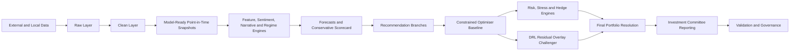
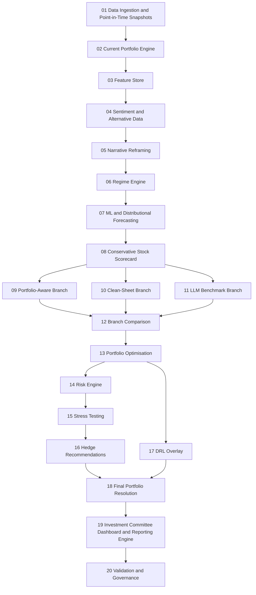
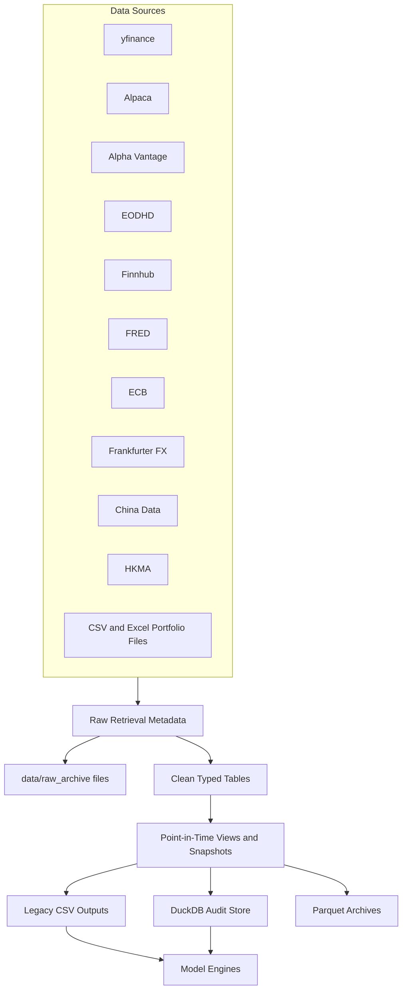
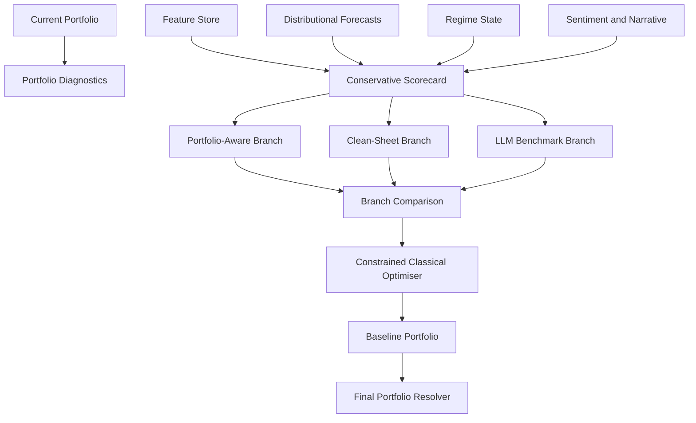
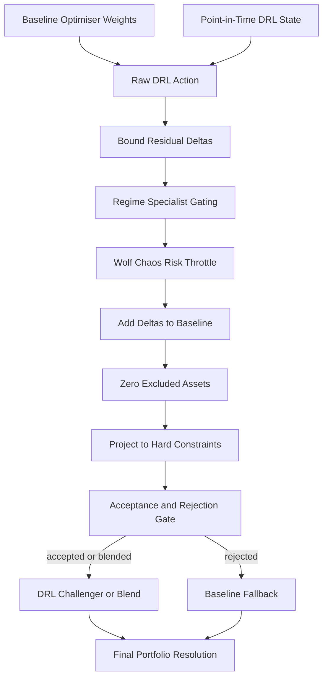
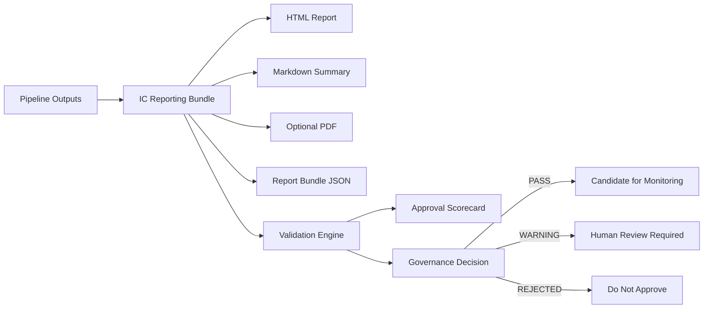
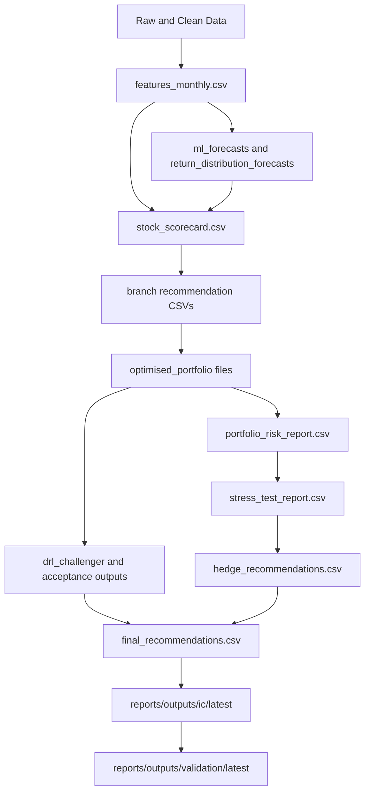
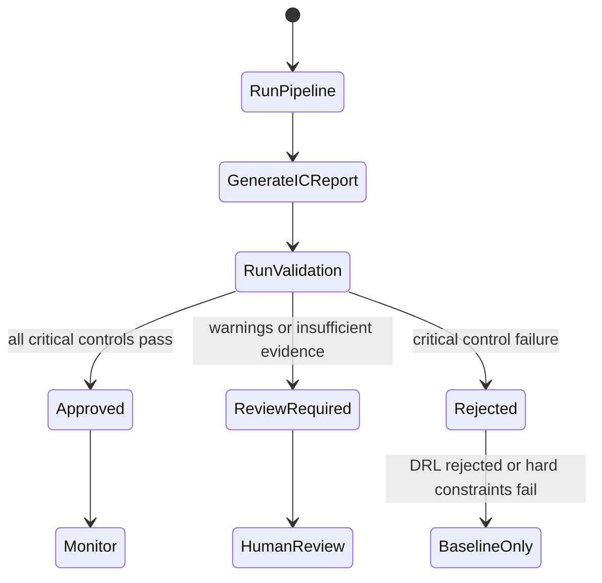

# Wolf Quant Model Architecture Diagrams

This document gives a visual map of The Wolf Quant Model from data ingestion through final governance. The diagrams are written in Mermaid so GitHub renders them directly.

## Executive Flow

The model is intentionally layered. Forecasts, scorecards and DRL proposals can influence recommendations, but hard portfolio constraints, risk governance and validation gates remain downstream controls.

## Full Pipeline

## Data Architecture

Key design rules:

- Raw payloads are archived outside DuckDB by default.
- DuckDB stores metadata, lineage, hashes, availability dates and typed clean tables.
- Macro revisions are inserted as new vintages rather than overwritten.
- `legacy_csv` remains the default backend until shadow comparisons and validation justify switching reads to DuckDB.
- Provider adapters normalise data before model code sees it.

## Portfolio Decision Stack

The optimiser is the primary allocator because it is deterministic and directly governed by explicit mandate, risk, concentration, liquidity and turnover constraints.

## DRL Residual Overlay

DRL is a challenger overlay, not an unrestricted replacement. In dry-run mode, the maximum DRL blend is capped at 25 percent and full replacement is disabled.

## Reporting And Governance

The validation engine is read-only. It does not tune forecasts, change weights or promote DRL. It evaluates whether the artifacts are fit for use.

## Sanity Checks And Diagnostics By Stage

| Stage | Diagnostics and Sanity Checks |
| --- | --- |
| Data ingestion and point-in-time snapshots | Provider status, request metadata, row counts, duplicate key checks, invalid currency checks, negative price checks, future `available_from` checks, input snapshot hashing, legacy-vs-DuckDB shadow comparison where enabled. |
| Current portfolio engine | Required column validation, CSV/Excel load checks, finite numeric checks, total NAV, weights summing to one, concentration, HHI, effective holdings and exposure summaries. |
| Feature store | Deterministic feature order, finite feature values, no future target columns, active universe coverage, region/country/currency alignment and missing-data diagnostics. |
| Sentiment and alternative data | Text document schema checks, entity/security mapping checks, event classification coverage, rolling feature aggregation checks and risk flag outputs. |
| Narrative reframing | Concept extraction coverage, frame construction, semantic distance sanity checks, transition probability normalisation and non-causal narrative labels. |
| Regime engine | Factor-regime probability sums, chaos-regime probability sums, Wolf Chaos Index bounds, transition matrix checks and dominant/secondary regime diagnostics. |
| ML and distributional forecasting | Forecast horizon labelling, finite P5/P50/P95 values, quantile ordering, VaR/CVaR/Expected Shortfall sign convention, forecast confidence bounds and probabilistic validation outputs. |
| Conservative scorecard | Hard exclusion filters, score component bounds, missing signal fallback checks, review flags and active universe membership. |
| Recommendation branches | Portfolio-aware and clean-sheet output schemas, LLM benchmark isolation, no LLM override of hard controls and branch disagreement flags. |
| Branch comparison | Consensus category assignment, disagreement commentary, missing branch handling and final review flags. |
| Portfolio optimisation | Long-only checks, sum-to-one checks, single-name caps, sector/country/region/currency caps, liquidity caps, turnover caps, cash floor and fallback portfolio generation. |
| Risk engine | Portfolio VaR, CVaR, Expected Shortfall, drawdown proxy, concentration, dividend-cut risk, liquidity risk and risk contribution ranking checks. |
| Stress testing | Required scenario coverage, portfolio loss percentage, portfolio loss USD, top contributor checks, hedge-required flags and post-stress value checks. |
| Hedge recommendations | Separation of equity substitutions from optional institutional hedge concepts, implementation complexity labels, cost/trade-off commentary and non-execution labels. |
| DRL overlay | State dimensions, eligibility mask, cash included, action bounds, hard constraint projection, turnover cap, risk throttle, fallback use, multi-seed stability, benchmark labels, ablations and non-causal explanations. |
| Final portfolio resolution | Explicit source precedence, invalid weight rejection, baseline/DRL challenger separation, accepted/rejected/blended status and final selected weight source. |
| IC reporting | Required HTML/Markdown/bundle artifacts, source lineage, deterministic narratives, chart generation, readiness status, report warnings and optional PDF handling. |
| Validation and governance | Leakage checks, chronological alignment, purge/embargo checks, forecast calibration, binary calibration, VaR backtesting, benchmark comparison, constraint validation, DRL validation, sensitivity, ablations, approval score and immutable run manifest. |

## Core Output Flow

## Governance Interpretation

A successful script run does not automatically mean the model is approved. The governance status is the authority for deployment readiness.

