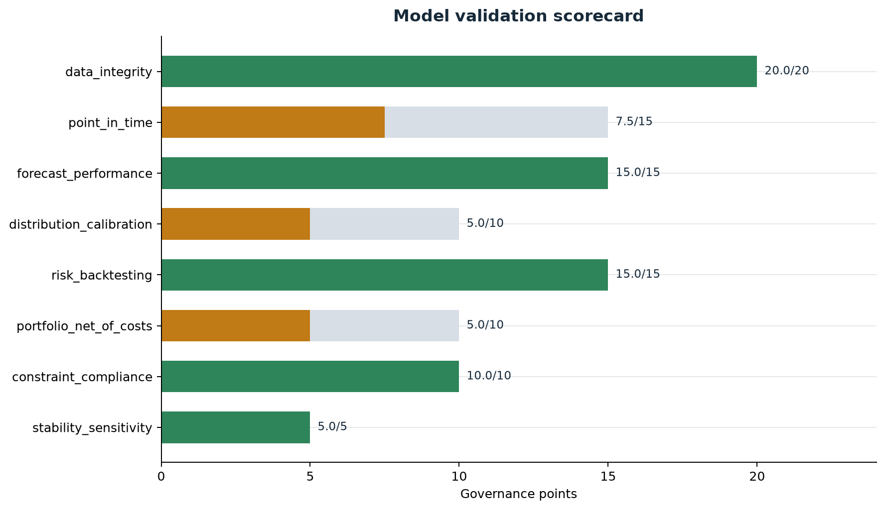
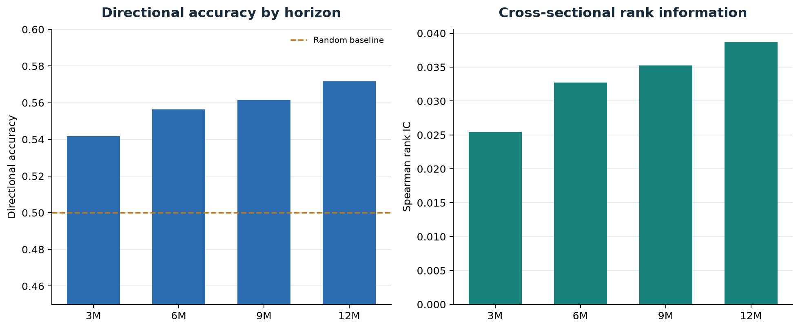
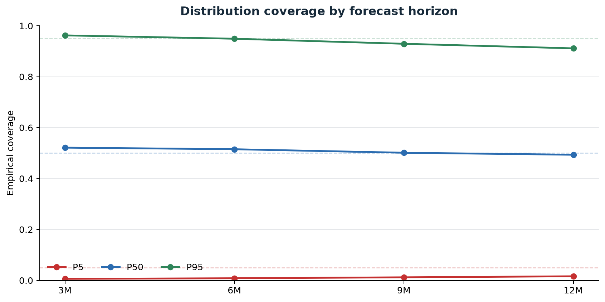
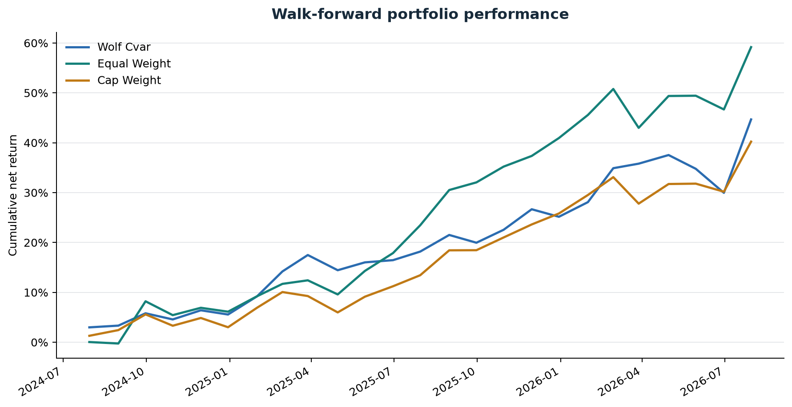
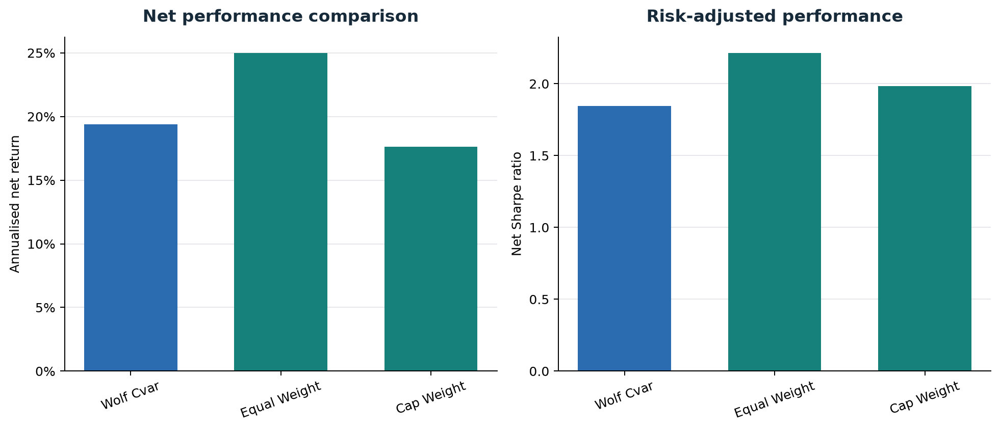
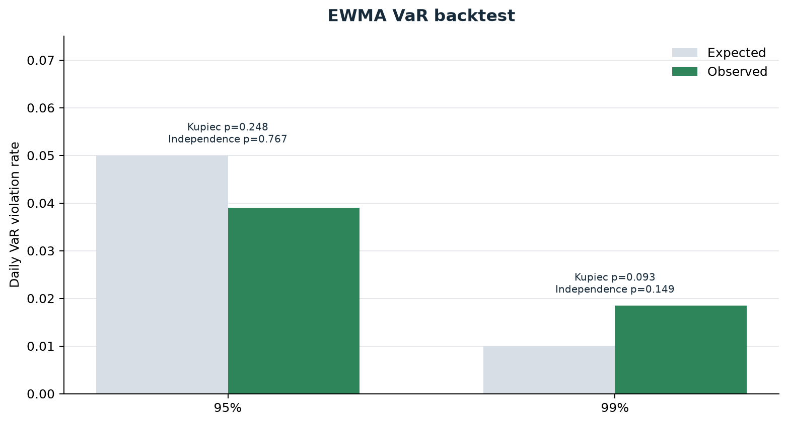
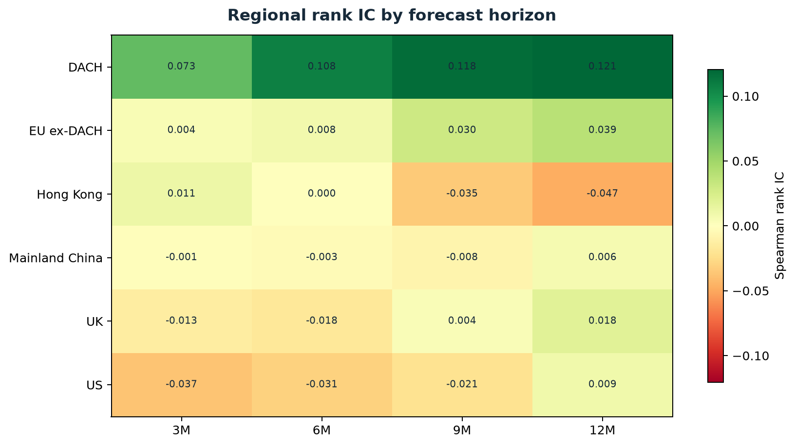

# Full-Universe Model Evidence

Validation run: `validation-20260812T083559-1d80b816`

## Decision

- Governance status: **CONDITIONALLY_APPROVED**
- Overall score: **82.5/100**
- Critical failures: **0**
- Active universe: **55,504** of **112,570** listed and historical securities
- Walk-forward evidence: **73,524** forecasts and **73,072** aligned outcomes
- Portfolio: **25** monthly decisions, **19.4%** annualised net return, **1.85** Sharpe

The result is capped at conditional approval because the free-source history reconstructs filing availability and does not provide immutable historical universe, volume, sentiment, narrative, or regime vintages.

## Scorecard

| component | score | status |
| --- | --- | --- |
| data_integrity | 20.0/20 | PASS |
| point_in_time | 7.5/15 | WARNING |
| forecast_performance | 15.0/15 | PASS |
| distribution_calibration | 5.0/10 | WARNING |
| risk_backtesting | 15.0/15 | PASS |
| portfolio_net_of_costs | 5.0/10 | WARNING |
| constraint_compliance | 10.0/10 | PASS |
| stability_sensitivity | 5.0/5 | PASS |

## Forecasts

All point-forecast horizons passed the configured directional-accuracy, rank-IC, and normalized-RMSE gates. Distribution coverage passes at 3M and 6M and remains a warning at 9M and 12M.

## Portfolio And Risk

The constrained Wolf portfolio is **WARNING** on the net-of-cost gate: annual turnover is 1.96x and annualised cost drag is 1.97%. It returned -5.60% per year relative to equal weight over this short sample; the paired test p-value is 0.473. Hard constraints and the daily EWMA VaR backtest remain separate passing controls.

## Package Contents

- `validation/`: complete governance output, including HTML and Markdown reports.
- `validation/portfolio_monthly_returns.csv`: all dated Wolf, equal-weight, and cap-weight control returns.
- `investment_committee/`: complete IC report bundle, PDF, data tables, and charts.
- `final_portfolio_weights.csv`: resolved 20-name final portfolio.
- `universe_summary.csv`: compact active and delisted security coverage by region.
- `walk_forward_manifest.json`: source profile, chronology checks, limitations, and evidence counts.
- `manifest.json`: SHA-256 checksum and byte size for every release artifact.

Research output only. Conditional approval is not authorization for unattended live trading.
