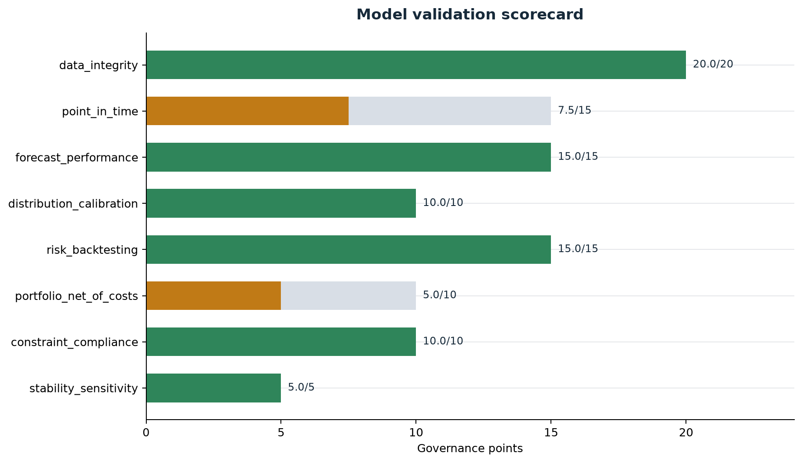
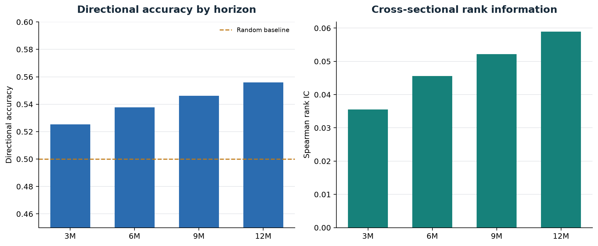
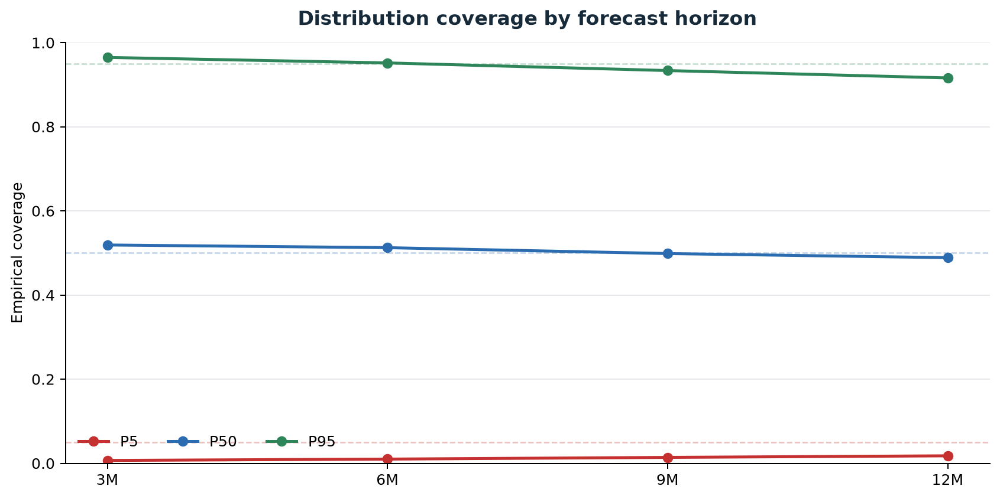
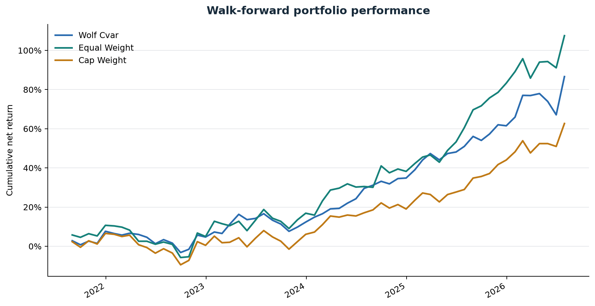
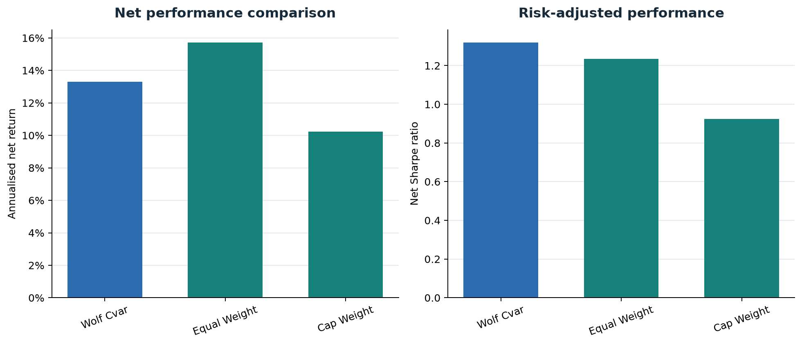
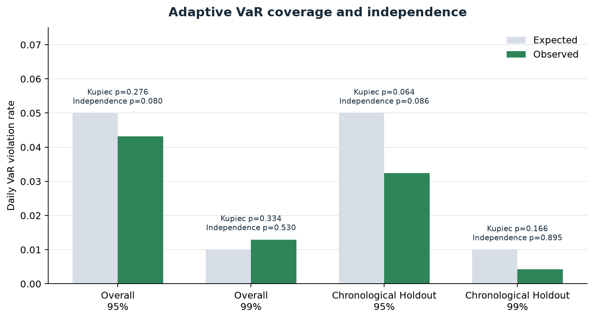
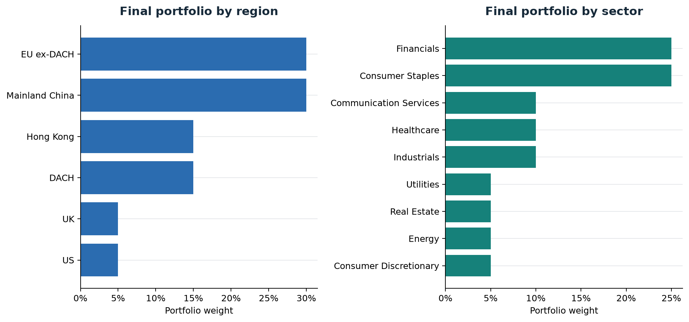
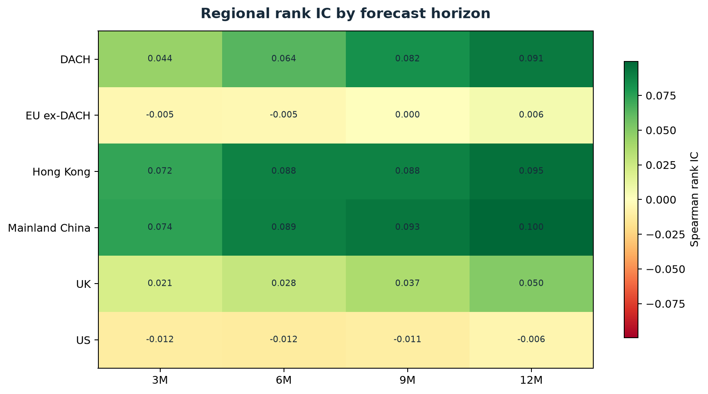

# Full-Universe Model Evidence

Validation run: `validation-20260813T184133-dccaac94`

## Decision

- Governance status: **CONDITIONALLY_APPROVED**
- Overall score: **87.5/100**
- Critical failures: **0**
- Active universe: **55,504** of **112,570** listed and historical securities
- Walk-forward evidence: **181,664** forecasts and **181,213** aligned outcomes
- Portfolio: **60** monthly decisions, **13.3%** annualised net return, **1.32** Sharpe

The result is capped at conditional approval because filing availability is still reconstructed where observed timestamps are unavailable. Delisting reference events are archived, but dated membership, inactive-name prices, historical volume, sentiment, narrative, and regime vintages remain incomplete.

## Scorecard

| component | score | status |
| --- | --- | --- |
| data_integrity | 20.0/20 | PASS |
| point_in_time | 7.5/15 | WARNING |
| forecast_performance | 15.0/15 | PASS |
| distribution_calibration | 10.0/10 | PASS |
| risk_backtesting | 15.0/15 | PASS |
| portfolio_net_of_costs | 5.0/10 | WARNING |
| constraint_compliance | 10.0/10 | PASS |
| stability_sensitivity | 5.0/5 | PASS |

## Forecasts

The point-forecast component is **PASS** and the distribution-calibration component is **PASS** under the configured gates.

## Portfolio And Risk

The constrained Wolf portfolio is **WARNING** on the net-of-cost gate: annual turnover is 1.10x and annualised cost drag is 0.82%. It returned -2.43% per year relative to equal weight over this short sample; the paired test p-value is 0.550. Hard-constraint compliance is **PASS** and the adaptive multi-model VaR backtest is **PASS**.

## Point-In-Time Evidence

The evidence store contains **59,183** delisting events. Observed filing acceptance, dated index membership, inactive-security prices, and historical-volume coverage remain below their governance thresholds and therefore retain a warning.
Aggregate Bloomberg coverage includes **25,240** database-as-of fundamental vintages and **694,246** historical market-cap vintages. Licensed observations are not included in this release.

## Package Contents

- `validation/`: complete governance output, including HTML and Markdown reports.
- `validation/portfolio_monthly_returns.csv`: all dated Wolf, equal-weight, and cap-weight control returns.
- `investment_committee/`: complete IC report bundle, PDF, data tables, and charts.
- `final_portfolio_weights.csv`: resolved 20-name final portfolio.
- `universe_summary.csv`: compact active and delisted security coverage by region.
- `walk_forward_manifest.json`: source profile, chronology checks, limitations, and evidence counts.
- `bloomberg_pit_coverage.csv`: aggregate licensed-data coverage only; no Bloomberg observations.
- `production_pit_coverage.md`: data-vintage semantics and measured production gaps.
- `manifest.json`: SHA-256 checksum and byte size for every release artifact.

Research output only. Conditional approval is not authorization for unattended live trading.
