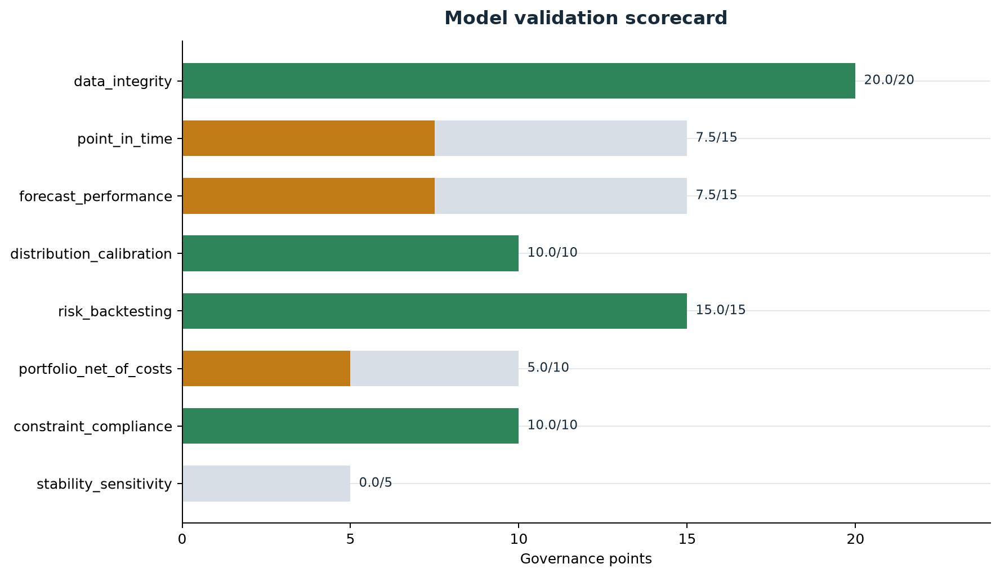
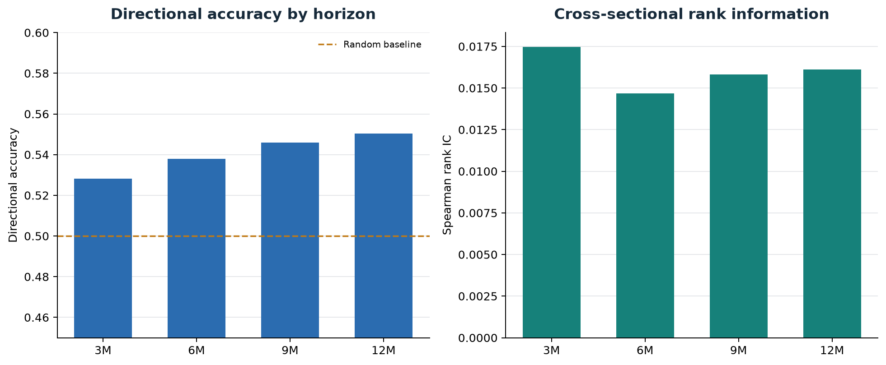
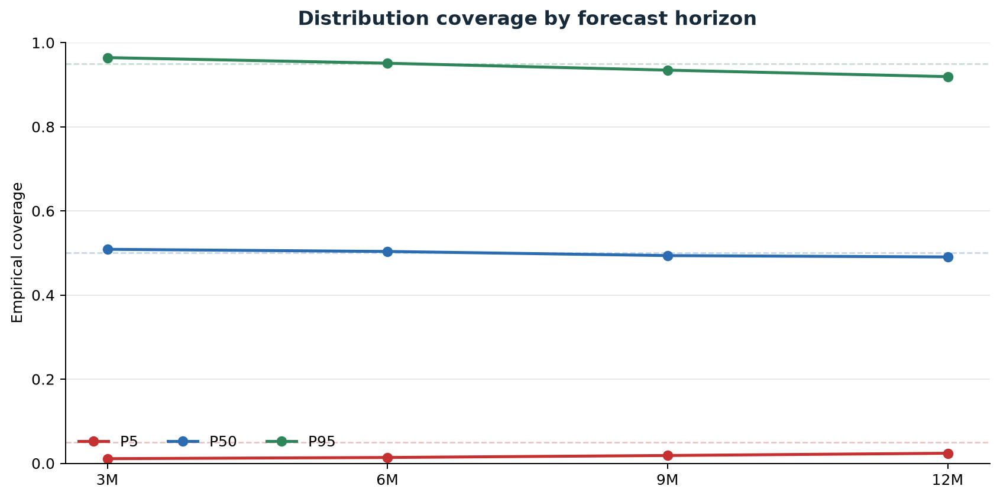
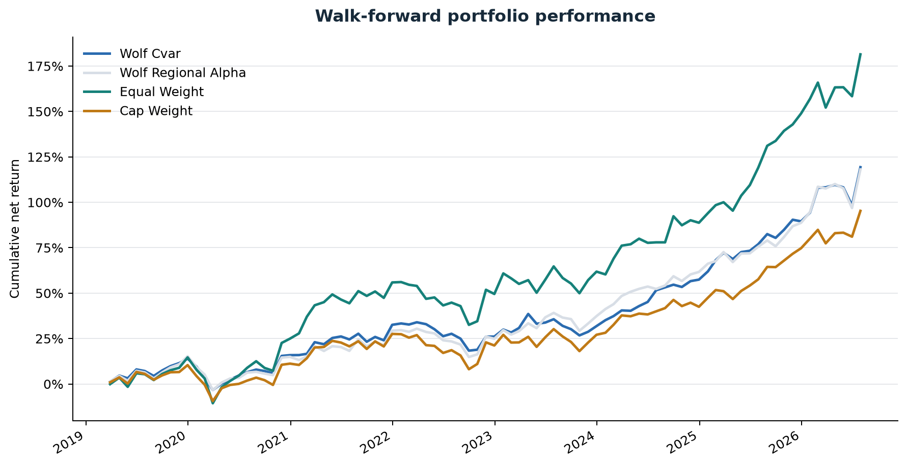
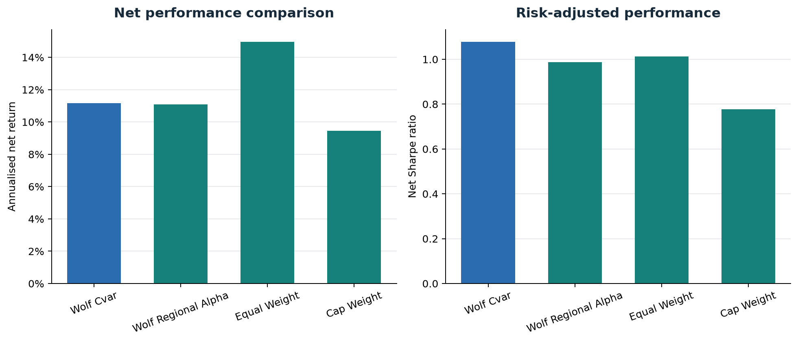
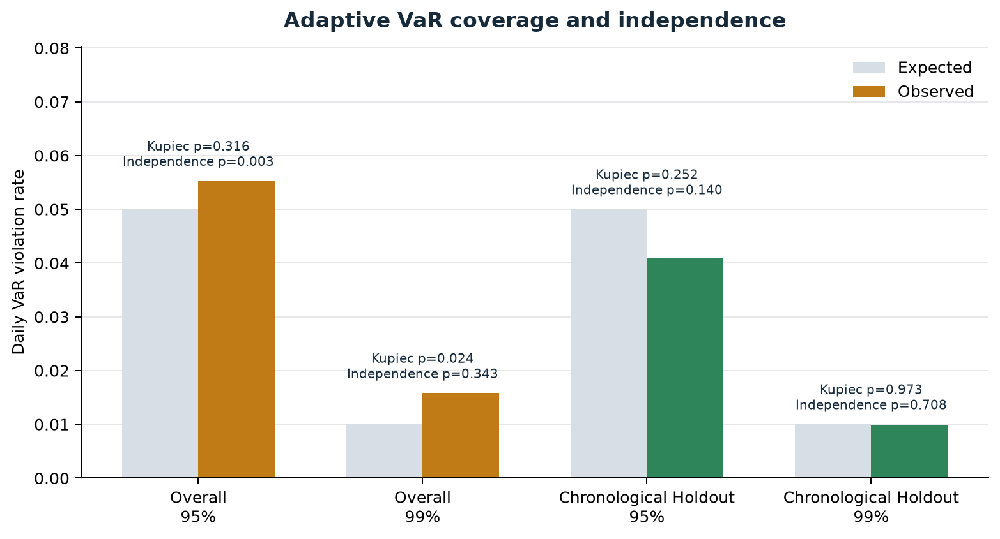
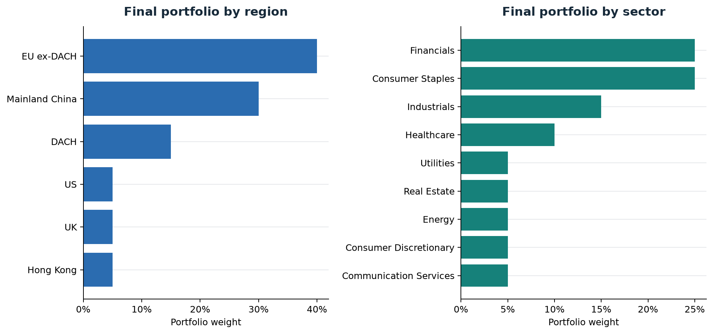
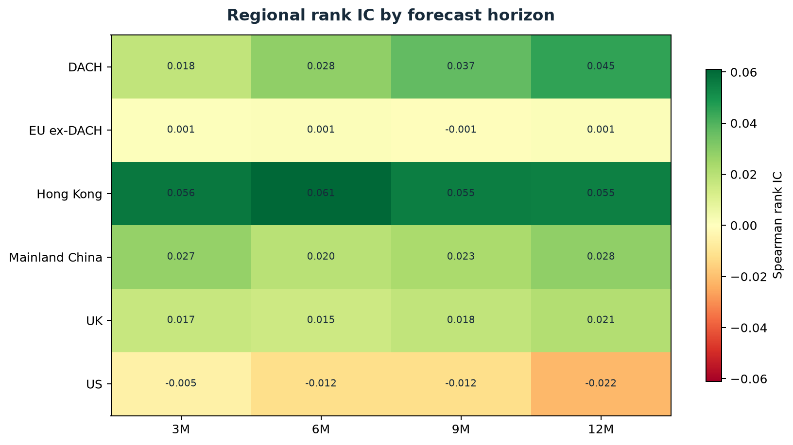

# Full-Universe Model Evidence

Validation run: `validation-20260819T071242-c060013a`

## Decision

- Governance status: **CONDITIONALLY_APPROVED**
- Overall score: **75.0/100**
- Critical failures: **0**
- Active universe: **55,504** of **112,570** listed and historical securities
- Walk-forward evidence: **263,048** forecasts and **262,627** aligned outcomes
- Portfolio: **89** monthly decisions, **11.2%** annualised net return, **1.08** Sharpe
- Regional-alpha challenger: **11.1%** annualised net return, **0.99** Sharpe
- Drawdown calibration: **isotonic**, locked-holdout ECE **2.63%**
- DRL selected source: **baseline_optimiser**; completed prospective shadow cycles: **0/3**

The result is capped at conditional approval because filing availability is still reconstructed where observed timestamps are unavailable. Delisting reference events are archived, but dated membership, inactive-name prices, historical volume, sentiment, narrative, and regime vintages remain incomplete.

## Scorecard

| component | score | status |
| --- | --- | --- |
| data_integrity | 20.0/20 | PASS |
| point_in_time | 7.5/15 | WARNING |
| forecast_performance | 7.5/15 | WARNING |
| distribution_calibration | 10.0/10 | PASS |
| risk_backtesting | 15.0/15 | PASS |
| portfolio_net_of_costs | 5.0/10 | WARNING |
| constraint_compliance | 10.0/10 | PASS |
| stability_sensitivity | 0.0/5 | FAIL |

## Forecasts

The point-forecast component is **WARNING** and the distribution-calibration component is **PASS** under the configured gates.

## Portfolio And Risk

The constrained Wolf portfolio is **WARNING** on the net-of-cost gate: annual turnover is 1.01x and annualised cost drag is 0.83%. It returned -3.80% per year relative to equal weight over this short sample; the paired test p-value is 0.250. Hard-constraint compliance is **PASS** and the adaptive multi-model VaR backtest is **PASS**.

## Point-In-Time Evidence

The evidence store contains **59,183** delisting events. Observed filing acceptance, dated index membership, inactive-security prices, and historical-volume coverage remain below their governance thresholds and therefore retain a warning.
Aggregate public-data evidence includes **12,188,157** AKShare bars across **3,374** China/HK securities, **23,222,164** yfinance China/HK bars with observed volume for **5,142** securities, **149,366** FRED/ALFRED macro-vintage rows, and **48,577** current OpenFIGI matches (92.4% coverage). SEC filing-vintage status is **blocked_or_unavailable**.
Legacy local licensed aggregates contain **25,240** fundamental and **694,246** market-cap vintages. No licensed observations are included in this release.

## Classical Challenger

The regional benchmark-relative, cost-aware strategy returned 11.09% annually versus 11.17% for Wolf CVaR and 14.97% for equal weight. Its Sharpe was 0.99, but the monthly improvement over Wolf was not statistically established (paired p-value 0.993). It remains a shadow challenger.

## Calibration, DRL And Shadow

Train-only isotonic calibration achieved 2.63% ECE on the locked drawdown holdout. PPO mean legacy-OOS information ratio was -1.01; the validation-selected simple challenger (contextual_bandit) also remained negative at -2.28. The baseline therefore keeps 100% weight. A pre-freeze rehearsal cycle is frozen; genuinely prospective decisions begin 2026-08-31. Three completed monthly outcomes are required before reconsideration.

## Package Contents

- `validation/`: complete governance output, including HTML and Markdown reports.
- `validation/portfolio_monthly_returns.csv`: all dated Wolf, equal-weight, and cap-weight control returns.
- `investment_committee/`: complete IC report bundle, PDF, data tables, and charts.
- `final_portfolio_weights.csv`: resolved 20-name final portfolio.
- `universe_summary.csv`: compact active and delisted security coverage by region.
- `walk_forward_manifest.json`: source profile, chronology checks, limitations, and evidence counts.
- `research/`: frozen DRL split, PPO seeds, simple challengers, skipped PIT anchors and shadow-operation status. Security-level licensed-derived challenger files remain local.
- `public_data/`: aggregate OpenFIGI, OpenBB, macro-vintage and long-history manifests; no credentials or raw provider payloads.
- `security/credential_history_audit.json`: redacted known-provider audit; current tree **PASS**, history **REQUIRES_REMEDIATION**. Provider-side revocation remains an owner action.
- `bloomberg_pit_coverage.csv`: aggregate licensed-data coverage only; no Bloomberg observations.
- `production_pit_coverage.md`: data-vintage semantics and measured production gaps.
- `manifest.json`: SHA-256 checksum and byte size for every release artifact.

Research output only. Conditional approval is not authorization for unattended live trading.
